Pythonista Games
----------------

This is a series of python word and board games to operate on the iPad using the excellent Pythonista app.

In general, the games do not work well on iPhone due to smaller screen area and the restrictions of touch interface.
Some optimisation has been made to operate in iPad Portrait mode, but Landscape is generally preferred.
The games do not autodetect orientation change.
All games were developed using a 13" Ipad. Most games have automatic detection of device size and orientation
on startup. Tested using Ipad 13", IPad 10", IPad Mini, IPhone.
IOS 26 introduces variable screen size. Rhe games will adapt to the current window size on  startup.  Some games do not render very well in portrait mode. You can resize the screen
to reduce the width and restart the program, which will frequently improve the appearance.
The  module change_screensize.py should be placed into site-packages (user). It allows creation of a virtual 
device window, and detection of virtual window size.

The games all use the Scene module, which is a thin wrapper around the Apple UiKit framework.

A generic gui framework has been developed to place a grid at maximum size, along with buttons and messages

Style apology:
Due to the limited debugging in Pythonista, I frequently used a non-preferred way to use list comprehensions
e.g. [print(x) for x in iterable]
This is to allow stepping over an iteration loop during debug.
Hint: a conditional breakpoint mode would be nice, or ability to set breakpoint in called module.

Games are:

Kye
---
My personal favourite from 1992. Superb program that plays best using a smart pencil.
Full credit to Colin Garbutt for the original program, and Colin Phipps for the Python version.
I have adapted GUI to use Pythonista for IOS rather than pygtk.
For further details on the game see https://en.wikipedia.org/wiki/Kye_(video_game),
  https://www.kye.me.uk/ and http://games.moria.org.uk/kye/

Entry point : Kye/Kye.py

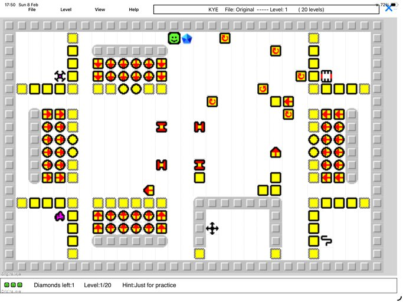

Sudoko
-------
Both classic, Killer and KenKen are supported.
The Sudoko solve engine is provided by 
http://norvig.com/sudoku.html

Entry point : Word_Games/Sudoku.py

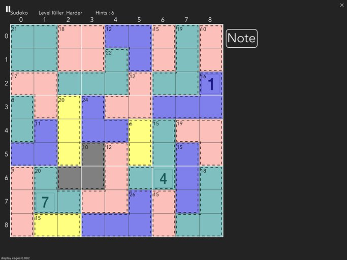

Suguru
------
Variant of Sudoko in which coloured cages contain
numbers 1 to size of cage, and no number can be next to the same 
in any direction.
New puzzles can be created, but beware that these can take a long time,
up to 30min for 9x9 grid.
Valid games are stored in suguru.txt (json format) , and are selected by
choosing Random NxN.
Any additionally created puzzles will be stored in suguru.txt
Run Word_Games/test_suguru.py to automate new puzzle creation.

Entry point : Word_Games/Suguru.py

Wordsearch
----------
 Another classic game.
 Multiple word categories included
 
 place engine word_square_gen.py from ?
 
Entry point : Word_Games/wordsearch.py

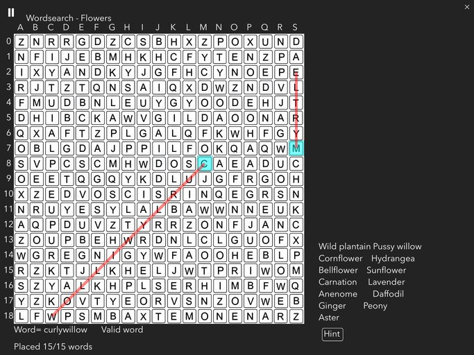

Scrabble
--------
Classic game, based on ai engine from Murat Sahin scrabble_ai_main
Plays a mean game.
Option for AI-AI game using 'Complete Game' in Pause Menu

Entry point : Word_Games/Scrabble.py

ZipWords
--------
Crossword grid filled with a selection of words.
Find the words to fit
Idea taken from Puzzler magazine

Entry point : Word_Games/Pieceword.py

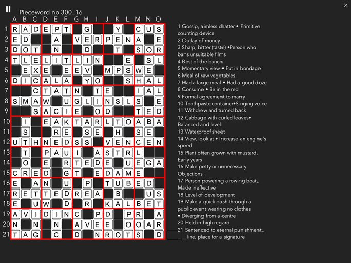

NumberWords
-----------
Crossword grid filled with a selection of words.
Find the letter linked to each number.
Idea taken from Puzzler magazine
The first puzzles are randomly genererated and may not include all letters.
All others are taken from published games in magazines and newspapers.

Entry point : Word_Games/NumberWord.py

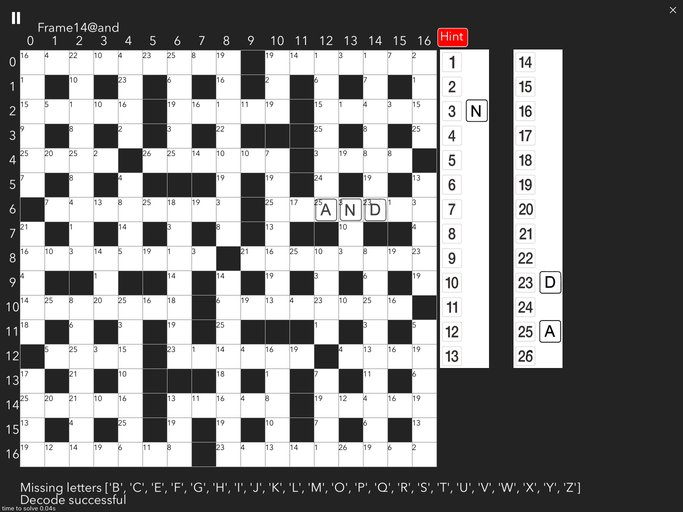

SkelNumbers
-----------
A variant of NumberWords when you have to find the blanks also

Entry point : Word_Games/SkelNumbers.py

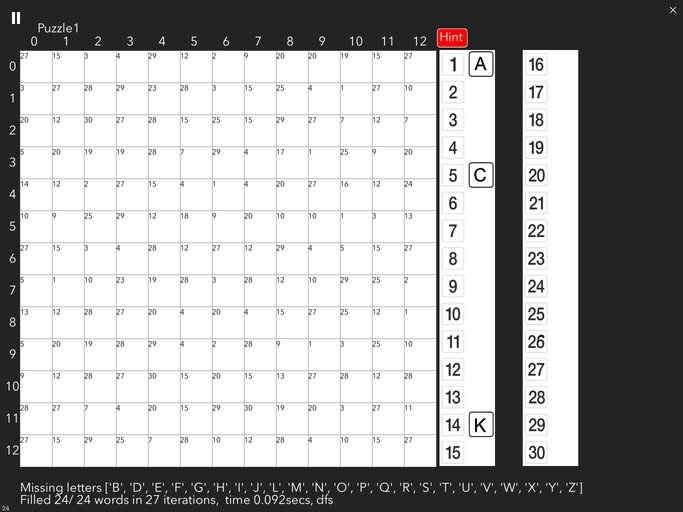

Anagram words
-------------
Crossword grid filled with a selection of words.
Find the words to fit

Entry point : Word_Games/anagram_word.py

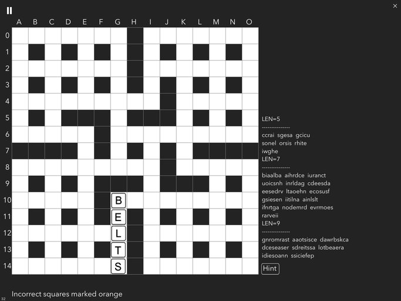

Pieceword
---------
A personal favourite.
3x3 word tiles are jumbled on a 15x21 grid. Use the clues to rearrange them.
Touch and dragging tile causes the tiles to swap position

Entry point : Word_Games/PieceWord.py

Dropword
--------
A crossword filled with a section of words. The black squares have been removed, causing
all the letter to drop. Reconstruct the crosssword by dragging the letters
to their correct locations

Entry point : Word_Games/Dropword.py

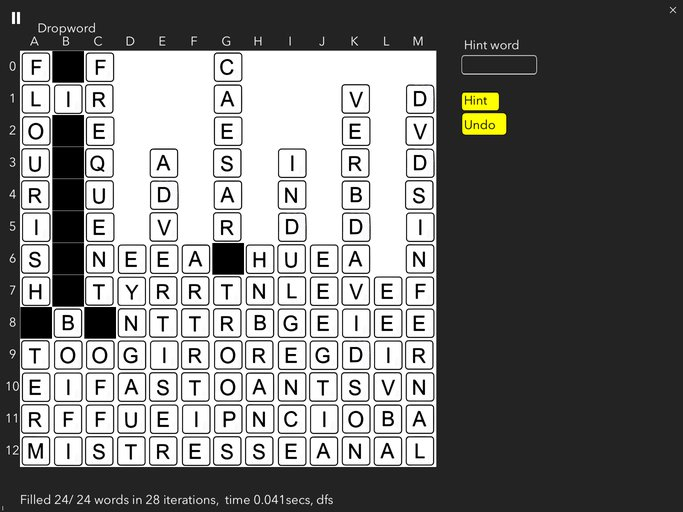

Krossword
---------
A reverse wordsearch. 
Place the given words in their correct locations given then starting points

Entry point : Word_Games/KrossWord.py

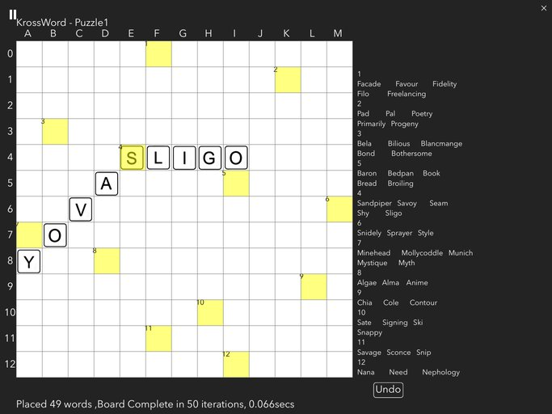

Wordle clone
------------
Choose 5 letters based upon scores for previous guess

Entry point : Word_Games/wordle.py

Word Circle
-----------
Create words from letters contained in a random 6 letter word.
Require 8 6-letter words, 8 5-letter words, 8 4-letter words,
and 8 3-letter words.
Letters can be used more than once.

Entry point : Word_Games/word circle.py

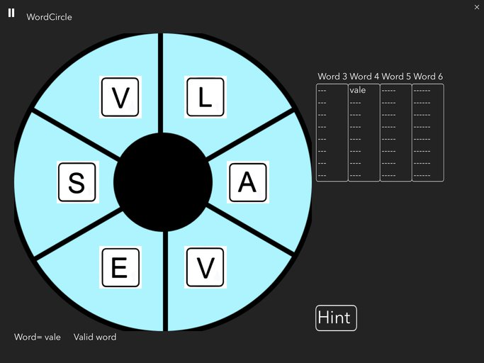

Quoteword
---------
Take a short quote (used Stephen Fry). Scramble the letters.
You must swap letters to descramble the quote.
This is WIP as the game is not very interesting at present

Entry point : Word_Games/Quoteword.py

Number Grid
-----------
Presents a grid with spaces, arithmetic operators and totals
Fill the spaces with unique numbers to complete the sums
Operations are computed L-R and T-B
Choose from 3x3 (nos 1-9), 4x4 (nos 1-16) or 5x5 (nos 1-25) if you dare

Entry point: Word_Games/Number_grid.py

Inequalities
------------
A simple modification to Number Grid.
Presents a grid with spaces and comparison between some values
Fill the spaces with unique numbers to satisfy the inequalities.

Entry point: Word_Games/Inequalities.py

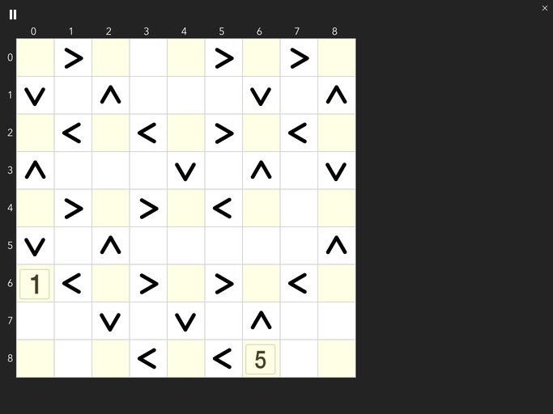

Crossword
---------
A simple program to manually solve crosswords produced by the  Crossword Creator program below 
and puzzles in crossword_puzzles.txt
Select in a word to enter letters.
Buttons 'Check' will check all words, and 'Hint' will fill a random word

Entry point : Word_Games/Crossword.py

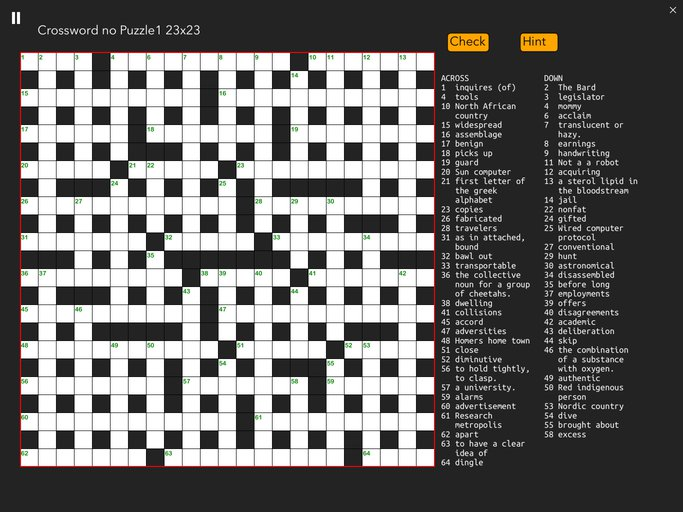

TrainTracks
-----------
A game published by puzzle books and newspapers to guess the route
of train tracks from A to B, using clues which number the tracks  in each row and column.
An editor to produce new puzzles is included.

The solver is taken from https://github.com/ianastewart/tracks with turtle graphics removed 

Entry point : Board_Games/TrainTracks.py

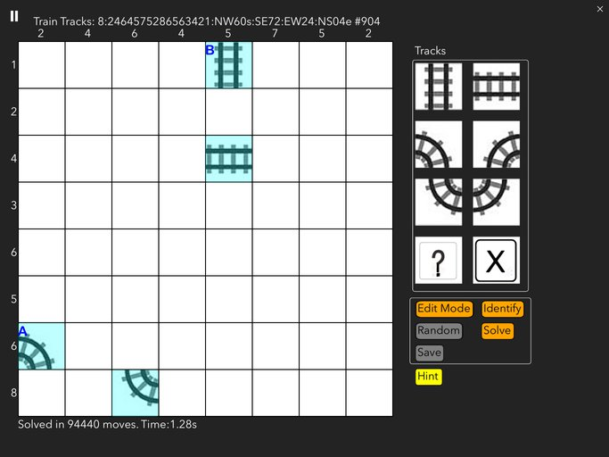

Tetris
------
Simple implemation of a classic game. 
An early attempt by me, could be prettier!

Entry point : Board_Games/tetris.py

Demolition
-----------
VERY simple ball drop program in the style of breakout.
Originally programmed on Commodore PET in 1983!

Entry point : Board_Games/demolition.py

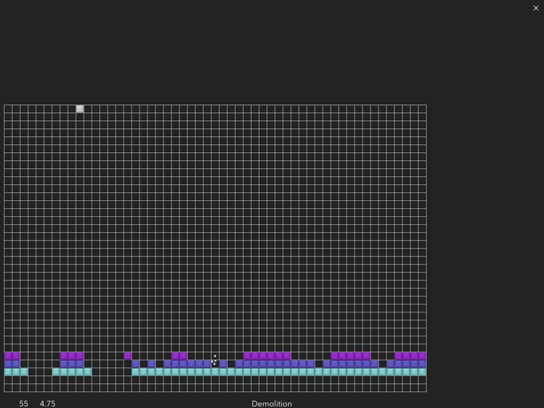

SeaBattle
---------
Modified from Game-Pigeon-Solvers by Kyle Gerner
https://github.com/k-gerner/Game-Pigeon-Solvers

Entry point : Board_Games/sea_battle/Sea_Battle.py

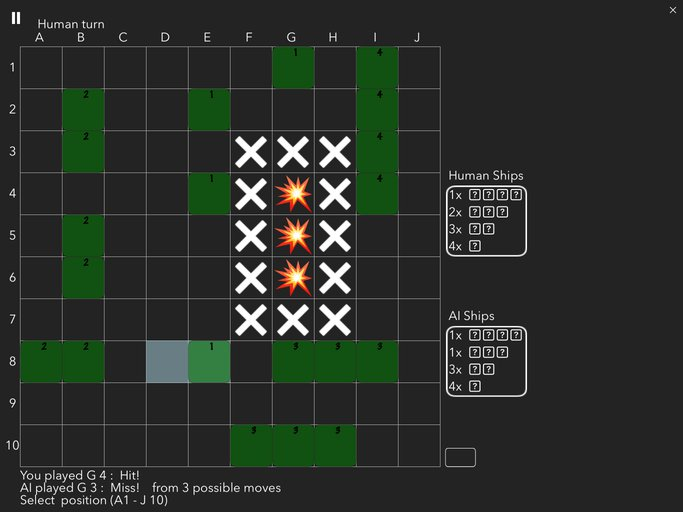

Othello
-------
Generated by Gemini AI and modified to use
Gui interface

Entry point : Board_Games/Othello.py

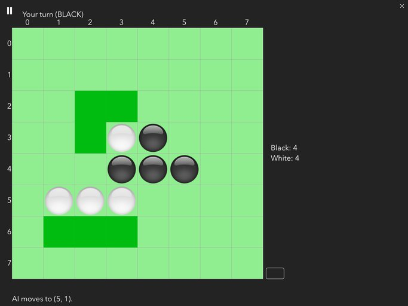

Connect4
--------
Modified from Game-Pigeon-Solvers by Kyle Gerner
https://github.com/k-gerner/Game-Pigeon-Solvers

Entry point : Board_Games/connect4/Connect4.py

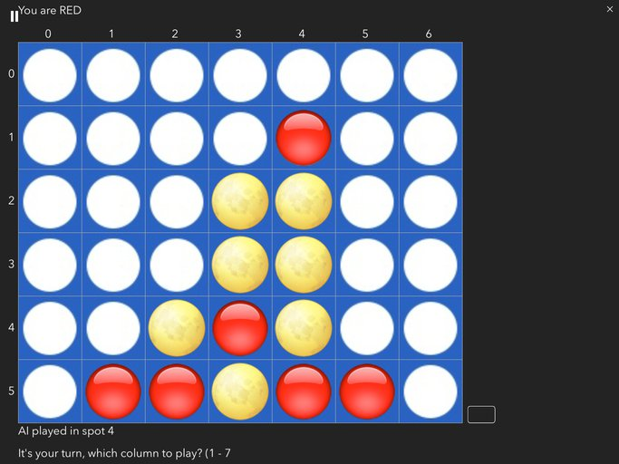

Minesweeper
-----------
Another classic game.

Entry point : Board_Games/MineSweeper.py

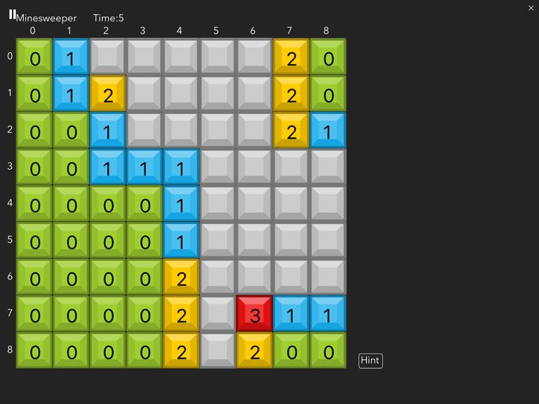

Chess (WIP)
-----------
A gui front end bolted on to https://github.com/niklasf/python/chess
Proof of concept, not complete

Entry point : Pychess/chess_gui_scene.py

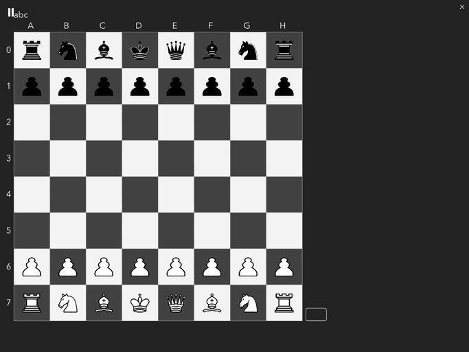

Dots
-----
Dots and Boxes 
modified from DotsAndBoxes M Sokhail Zakir/ Ammara Riaz 

Entry point : Board_Games/Dots.py

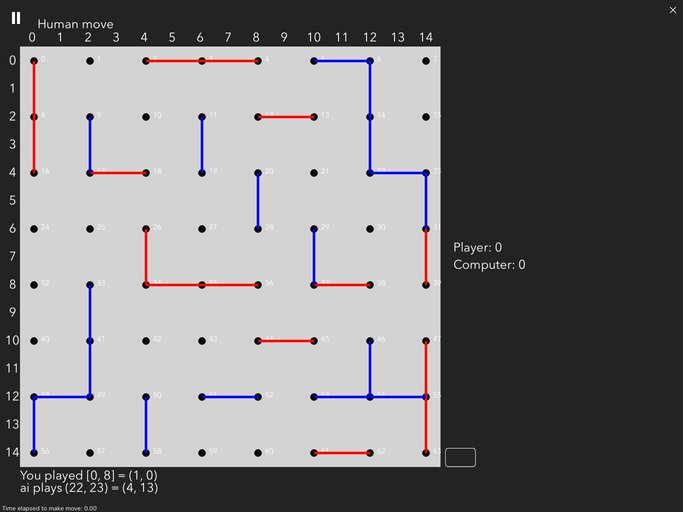

MazeGame
--------
Displays a grid maze using one of several generating algorithms.
Best played using a pencil or larger grids.
May form basis of other maze games.

End point is randomly placed.
Solution is automatically calculated, and compared with path being drawn.

Uses mazelib from https://github.com/john-science/mazelib
(small change to remove invalid import cython )

Entry point : Board_Games/MazeGame.py

Tiles
-----
Sliding puzzle game
can select numbers or any image from the photo library
requires installation of slidingpuzzle from pypi

Entry point : Board_Games/tiles.py

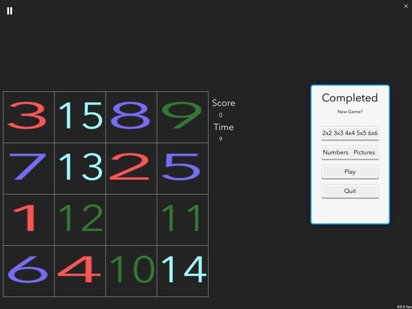

Caterpillar
-----------
a version of Snake modelled on The Very Hungry Caterpillar for my grandchildren

Entry point : Board_Games/caterpillar.py

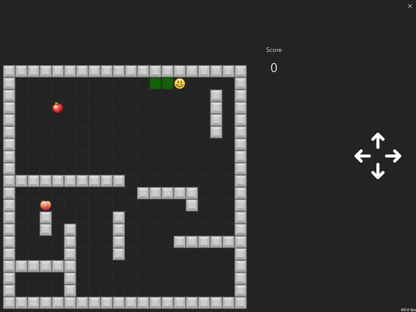

Space Shooter
-------------
Modified and improved(?)
# https://gist.github.com/anonymous/a03bfdab757c1d978061
Changed icons, added shields, and quite a bit of refactoring

Entry point : AI_games/a_spaceShooter.py

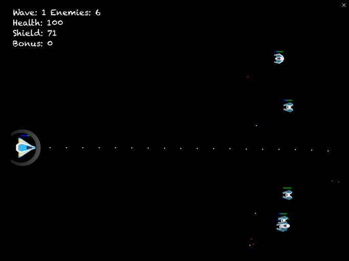

Klondike
--------
Classic card game known also as Solitaire.
Games have been preselected to be maybe solvable.
Drag the cards to new positions or just touch the card to perform best move.

Entry point : Card_Games/Klondike.py

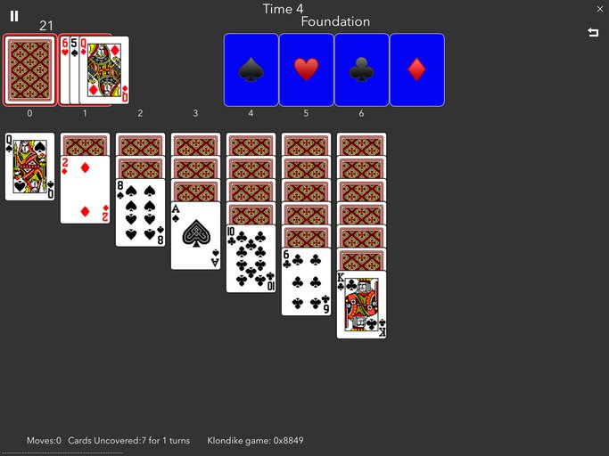

Freecell
--------
Classic solitaire card game.
Drag the cards to new positions
Entry point : Card_Games/Freecell.py

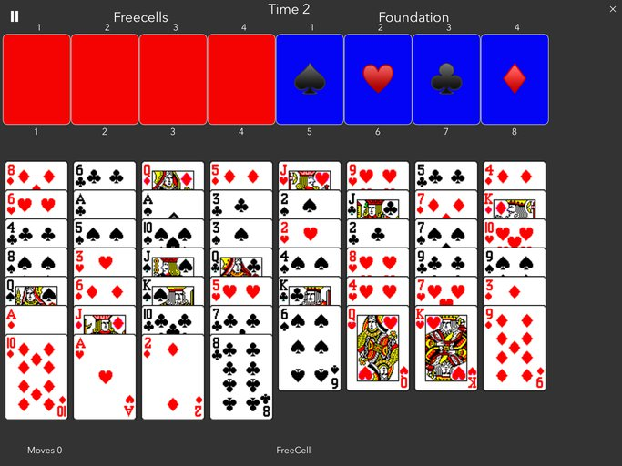

Jigsaw Puzzle
-------------
A classic rendering of a jigsaw puzzle.
Creates random puzzle from scratch, with good control over jigsaw piece appearance.
You select puzzle number of pieces and select an image from your photo library.
A Finish button will animate any remaining unplaced pieces.
Uses class  Piece in jigsaw_piece.py which could be used for other games.

Entry point: Board_Games/jig_saw_2.py

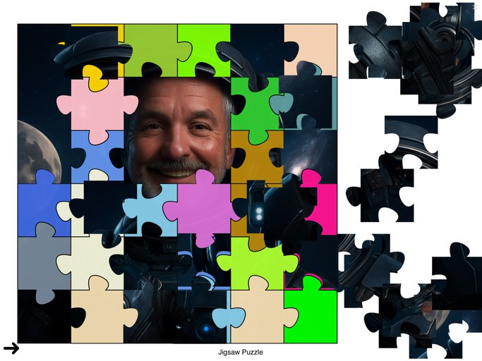

Adventure
---------
Classic adventure game, coded in Python from the original Colossal Caves program
by Brandon Rhodes.
I have added a GUI frontend for Pythonista, but left the adventure folder untouched.
Added Map.JPG and locations.csv to higlight locations.

Entry point: python_adventure/Python_Adventure.py

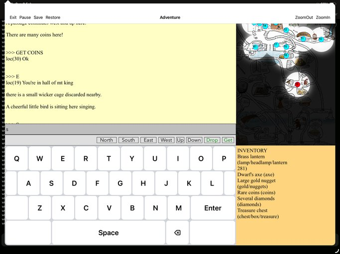

AI Games
--------
I have been experimenting with using Google Gemini AI to create some classic games.
VERY impressive!
See AI_games/readme.md for more details
So far, created and fixed:
Pool,  Pong, Tank, Missile Command, Galaxians, Flappy Bird, and a couple of small demos

Game Utilities
--------------

Ocr
---
This is used to read text from an image, and also used to create crossword frame.
Uses Apple UiKit for Ocr. Attempts made to read single letters from crossword grid, but not very successful.
experiences crashes sometimes, hence each move is stored in numpy array for instant recovery.

Entry point : Word_Games/scanning/Ocr.py

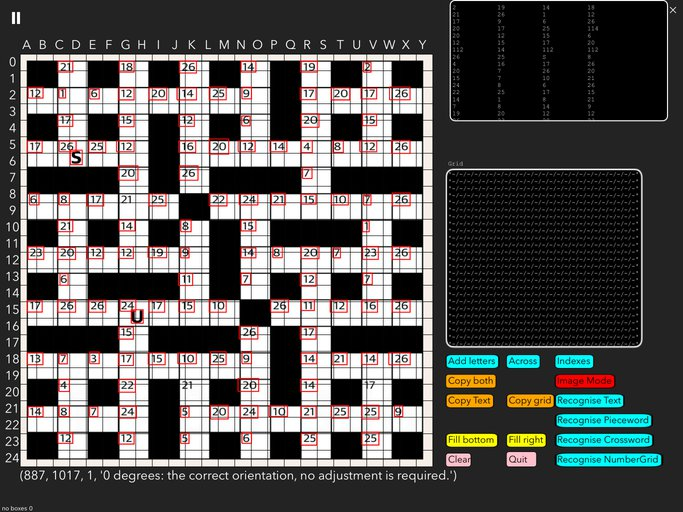

Pieceword Creator
-----------------
A utility to produce custom PieceWord puzzles.
This is a fixed size 21x15 crossword which is scrambled before storing.
The utility allows looking up definitions and synonyms for each of the
'Across' words using both https://www.merriam-webster.com/dictionary/word
(need user key)
and  https://www.thefreedictionary.com
Clues can be selected from returned lists and subsequently edited.
Resulting puzzle data can be copy/pasted into file piecewords.txt

Entry point : Word_Games/pieceword_create.py

Crossword Creator
-----------------
A utility to produce custom crossword puzzles (British or Cryptic style)
This is a fixed size 21x15 crossword which is scrambled before storing.
The utility constructs a grid of defined size using random words.
It allows looking up definitions and synonyms for each of the
words using both https://www.merriam-webster.com/dictionary/word (need user key)
and  https://www.thefreedictionary.com
Clues can be selected from returned lists and subsequently edited.
Resulting puzzle data can be copy/pasted into file crossword_puzzles.txt
No app created yet for solving the crossword as I am more interested in creating
them than solving!

Crossword generation and word filling  is contained in Word_Games/crossword_create.py

Entry point : Word_Games/general_crossword_create.py

.

Notes
-----

Much of the  working engines of these games were provided by other developers.
I have added the gui front end for use on ios using Pythonista, along with any changes I saw fit.

All games have a Pause Menu button in top left corner with various options

Crossword filling with random words proved particularly challenging, but was mostly successful. 
I would be very interested in any improvements.
Now using a modification of swordsmith (https://github.com/adamaaronson/swordsmith) with good results.

Some games, e.g. wordsearch, rely upon touch dragging to select direction and length. 

Each game is based on a hierarchy of modules.

The lowest level, gui/gui_scene.py, handles the screen drawing and other graphics

gui/gui_interface is the user interface level. Many functions simply call the lower level functions.

Word_Games/Letter_games.py is used as a base class for many of the crossword type games.
